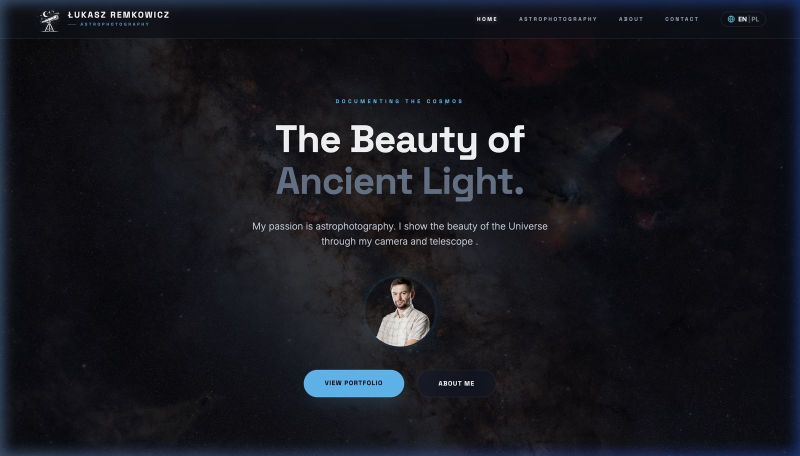
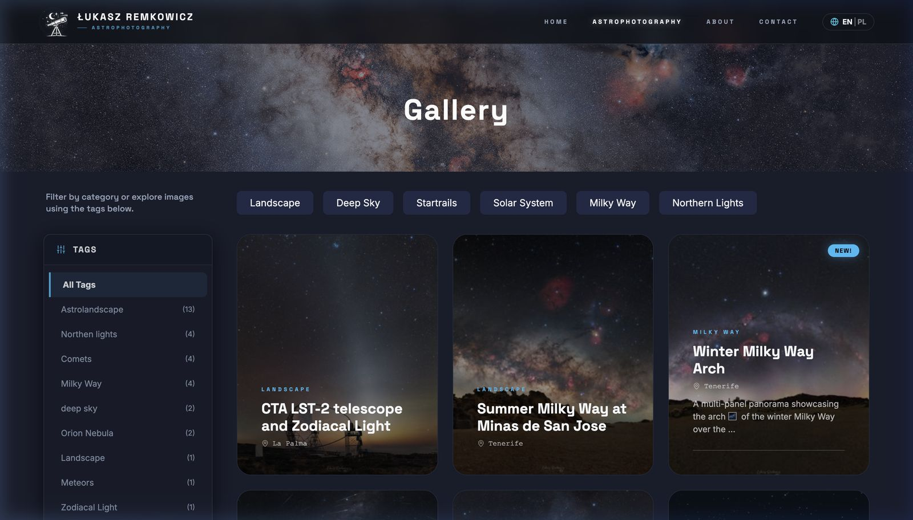
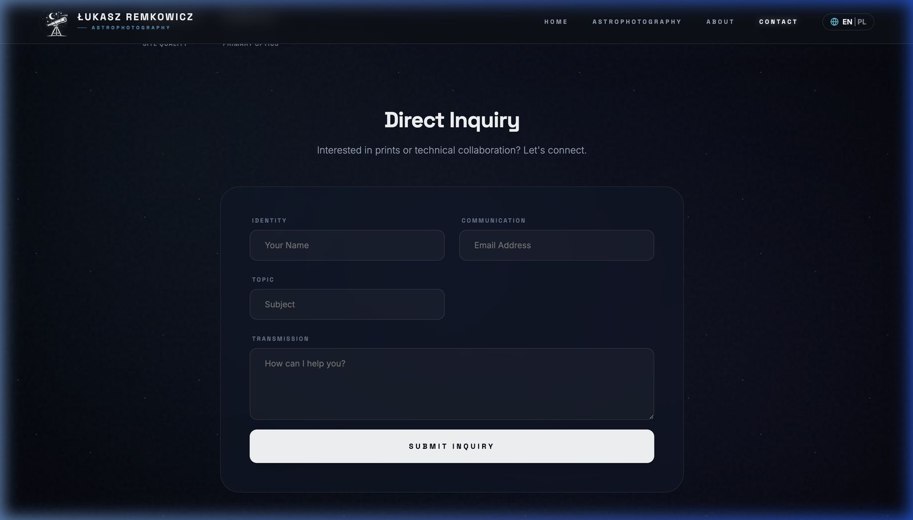
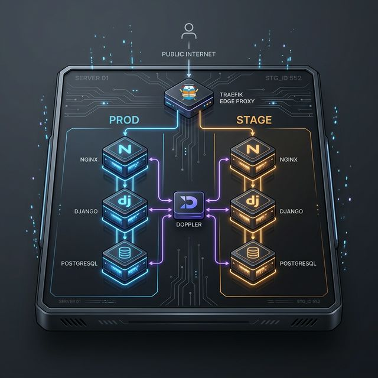

# Portfolio Landing Page

A modern, API-driven personal portfolio web app with subpages for Astrophotography, Programming, and Contact. Built with React (frontend) and Django + Django Rest Framework (backend), fully dockerized and orchestrated with nginx for local HTTPS development.

## 🌐 LIVE

Check out the live version: **[lukaszremkowicz.com](https://lukaszremkowicz.com)**

## 📸 Screenshots

<details>
<summary><b>Click to expand screenshots</b></summary>

### Home Page


### Astrophotography Gallery


### Contact Form


</details>

## Quick Start

### 1. Clone the repository
```sh
git clone <your-repo-url>
cd landingpage
```

### 2. Configure Environment (Doppler)

We use **Doppler** for secure secret management. Before starting, ensure you have the Doppler CLI installed and are logged in.

```bash
# Login to Doppler
doppler login

# Setup the project for the current directory
doppler setup
```

### 3. Start all services with Docker Compose

Always use `doppler run` to inject secrets into your Docker containers. Use the `--config` flag to specify the environment.

```bash
# For local development (default dev config)
doppler --config dev run -- docker compose up --build

# For staging
doppler --config staging run -- docker compose up --build
```

- Frontend: https://portfolio.local/
- API: https://api.portfolio.local/
- Backend Admin: https://admin.portfolio.local/

> **Note:** You may need to add these domains to your `/etc/hosts` file:
> ```
> 127.0.0.1 portfolio.local api.portfolio.local admin.portfolio.local
> ```

### 3. Access Django Admin
- Go to https://admin.portfolio.local/admin/
- Log in with your superuser credentials (create one if needed)
- Update your profile, bio, and avatar in the Users section

## Development

### Frontend Development
```bash
cd frontend
npm install
npm start          # Development server
npm test           # Run test suite
npm run build      # Production build
```

### Backend Development
```bash
cd backend
poetry install
poetry shell
python manage.py runserver
```

### Docker Development
```bash
# For newer Docker versions (Docker Compose V2)
docker compose up --build    # Start all services

# For older Docker versions (Docker Compose V1)
docker-compose up --build    # Start all services
docker-compose exec portfolio-fe npm test    # Run frontend tests
```


## 🏗️ Architecture

The project follows a modern, highly decoupled architecture for performance and security:

## 🏗️ Architecture

The project follows a modern, highly decoupled architecture for performance and security. It supports **Environment Isolation** (Production & Staging) on the server, with an identical stack for **Development** (Local):



### Key Components:
- **Traefik (Edge Proxy)**: The central entry point for all subdomains. Handles SSL, HSTS, and routing.
- **Environment Isolation**: Parallel stacks (`PROD` and `STAGE`) ensure zero-collision deployments.
- **Development Stack**: Local development uses the exact same `Traefik + Nginx + Django + PostgreSQL` architecture via `portfolio-dev`.
- **Doppler**: Centralized, secure secret management across **all** environments (Local & Server).

---

## 🚀 Deployment & Environments

The project uses isolated naming conventions to ensure zero-collision between environments:

### 1. Project Naming (Standardized)
- **Production**: `portfolio-prod`
- **Staging**: `portfolio-stage`
- **Development**: `portfolio-dev` (Local machine)

### 2. Deployment Commands
Always use the explicit Doppler configuration to avoid accidents:

```bash
# BUILD:
doppler run -p portfolio -c portfolio-prod -- ./infra/scripts/release/build.sh

# DEPLOY:
cd ~/portfolio
doppler run -p portfolio -c portfolio-prod -- ./infra/scripts/release/deploy.sh
```

**What the deployment script handles:**
- **Auto-Switch**: Detects and stops any legacy container naming before starting the new stack.
- **HSTS/CSP**: Applied automatically via Traefik middlewares.

---

## 💾 Database Backup & Maintenance

Database maintenance scripts are located in `infra/scripts/db_backup/`.

### 1. Manual Backup
Create a compressed SQL dump of the production database:
```bash
./infra/scripts/db_backup/backup_db.sh
```
The backup should be stored outside the repository, for example in `/var/backups/portfolio/`.

### 2. Testing Restores
Always verify your backups by running a test restore:
```bash
./infra/scripts/db_backup/test_restore.sh
```
This script creates a temporary container and verifies that the SQL dump is valid and can be fully imported.

See [Backup Maintenance Guide](/Users/lukaszremkowicz/Projects/landingpage/infra/scripts/db_backup/MAINTENANCE.md) for more details.

## Testing

### Backend (Dedicated Service)
The backend tests now run in a dedicated, isolated environment using Docker Compose Profiles. This inherits your development configuration but remains isolated.

```bash
docker compose run --rm portfolio-test
```

### Frontend
```bash
docker compose exec portfolio-fe npm test    # Local development (fastest)
docker compose run --rm portfolio-fe npm test -- --watchAll=false  # Isolated
```

## 🔄 Release Lifecycle

To ensure version traceability and zero-downtime, follow this mandatory flow for all new features and fixes:

### 1. Development to Dev
- **Merge Request**: Create an MR from your feature branch to `dev`.
- **Squash & Delete**: Perform a **Squash and Merge** and delete the feature branch to keep history clean.

### 2. Versioning (Tags)
- **Tag the Commit**: Once code is on `dev`, tag it with a version (e.g., `v1.2.0`).
- **Push Tag**: `git push origin v1.2.0`
- **Automatic Detection**: The `build.sh` and `deploy.sh` scripts automatically detect this tag and use it as the Docker image reference.

### 3. Promotion to Main
- **Merge Request**: Merge `dev` into `main`.
- **Production Anchor**: This ensures `main` always stable and aligned with a specific Git tag.

### 4. Direct Deployment
On your production server, simply run:
```bash
# TAG is auto-detected from the Git tag on main
./infra/scripts/release/deploy.sh
```

> [!IMPORTANT]
> **Production Requirement**: Deployments **must** use a Git tag as the reference. This allows for instant rollbacks by just changing the `TAG` variable.

---

## 📋 Component-Specific TODOs
- **Frontend TODOs**: See [Frontend README](frontend/README.md#-todo--future-improvements)
- **Backend TODOs**: See [Backend README](backend/README.md)
