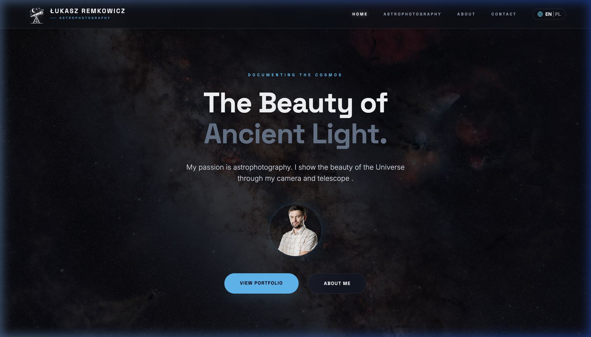
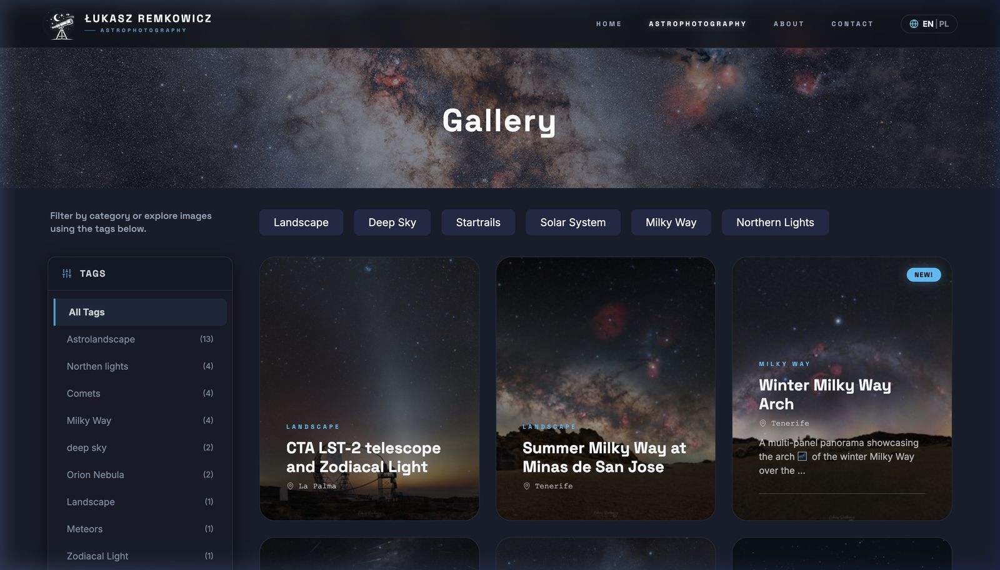
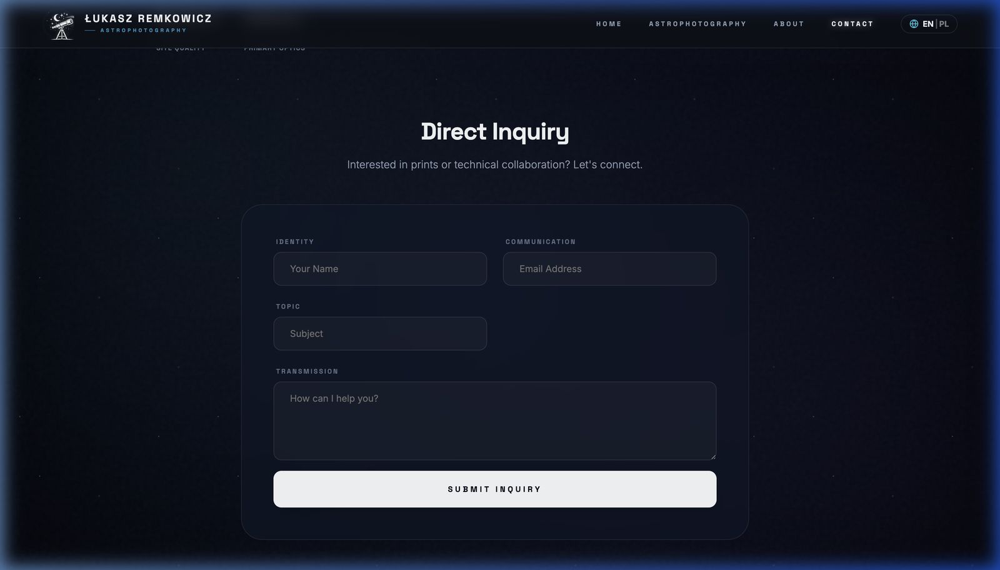
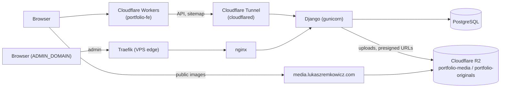

# 🌌 Portfolio Landing Page

Backend, nginx and infrastructure for a personal portfolio (astrophotography, travel stories, programming work). This repository holds the Django 6 backend (admin only) (Python 3.14, `uv`), the nginx layer, Docker/compose files and the release scripts. The frontend lives in [`LukaszRemkowicz/portfolio-fe`](https://github.com/LukaszRemkowicz/portfolio-fe) (React Router 7 on Cloudflare Workers).

## 🌍 Live

- Site: [lukaszremkowicz.com](https://lukaszremkowicz.com)

## 📸 Screenshots

<details>
<summary><b>Click to expand screenshots</b></summary>

### Home Page


### Astrophotography Gallery


### Contact Form


</details>

## 🏗️ Architecture

Production request path: the browser talks to the Cloudflare Workers frontend (`portfolio-fe`), which reaches this stack through a Cloudflare Tunnel. Django runs only as the admin (locally, against Supabase); the public API and sitemap are served by the Supabase Edge Function; media is stored in Cloudflare R2.

Moving off the VPS: the public API also runs as a Supabase Edge Function over the Supabase database (`supabase/`), reachable only through the Worker, and the production admin runs locally against Supabase. See [Supabase API and local admin](infra/docs/project/supabase_api.md).


```mermaid
flowchart LR
    Browser["Browser"] --> Workers["Cloudflare Workers<br/>(portfolio-fe)"]
    Workers -->|"API, sitemap"| Tunnel["Cloudflare Tunnel<br/>(cloudflared)"]
    Tunnel --> Django["Django (gunicorn)"]
    Admin["Browser (ADMIN_DOMAIN)"] -->|"admin"| Edge["Traefik (VPS edge)"]
    Edge --> Nginx["nginx"]
    Nginx --> Django
    Django --> DB[("PostgreSQL")]
    Django -->|"uploads, presigned URLs"| R2[("Cloudflare R2<br/>portfolio-media / portfolio-originals")]
    Browser -->|"public images"| MediaHost["media.lukaszremkowicz.com"]
    MediaHost --> R2
```

- `cloudflared` is a compose service (profile `tunnel` in `docker-compose.prod.yml`). It is started separately and is not touched by the deploy. See [infra/scripts/README.md](infra/scripts/README.md).
- Traefik runs on the VPS edge. `deploy.sh` also uses it for its health check (HTTPS to `SITE_DOMAIN` via `127.0.0.1:443`).
- nginx config: [infra/nginx/](infra/nginx/). It still has an `fe:8080` upstream (`infra/nginx/static_server.conf`). On the VPS an old orphan `fe` container (no longer defined in this repo's compose) keeps running so nginx can resolve it. Do not remove it until that upstream is removed.
- Local development runs only `Django + PostgreSQL` through `docker-compose.yml` (no Traefik, no nginx).
- Secrets come from Doppler.

## 🗂️ Repository Layout

- `backend/` - Django application: admin, translations, media logic, background tasks (`common/background.py`)
- `docker/` - Dockerfiles and entrypoint for the backend (`docker/backend/`) and nginx (`docker/nginx/`)
- `infra/nginx/` - nginx config and includes
- `infra/scripts/` - release scripts (`release/`), DB backup scripts (`db_backup/`), shared helpers
- `infra/docs/` - agent docs (`agent/`) and project docs (`project/`)
- `docker-compose.yml`, `docker-compose.common.yml`, `docker-compose.prod.yml` - dev, shared and production stacks
- `.github/` - CI/CD workflows, secrets doc, PR templates
- `screenshots/` - README screenshots

Component docs:

- Backend: [backend/README.md](backend/README.md)
- Infra scripts: [infra/scripts/README.md](infra/scripts/README.md)

## 📖 Glossary

- `SITE_DOMAIN`: public website host, for example `portfolio.local`.
- `ADMIN_DOMAIN`: public Django admin host, for example `admin.portfolio.local`.
- `X-Request-ID`: request correlation header. The backend reuses or creates it, echoes it in responses and logs it.

## 🖼️ Media

`MEDIA_STORAGE` selects the storage backend: `r2` (default) or `local`. Dev compose and tests use `local` (files on disk, served by Django).

In `r2` mode (code: [backend/common/storage.py](backend/common/storage.py)):

- public bucket `portfolio-media`, served at `media.lukaszremkowicz.com`: generated thumbnail and detail variants
- private bucket `portfolio-originals`: source uploads and high-resolution variants, served through short-lived presigned URLs
- secrets `R2_ACCESS_KEY_ID` and `R2_SECRET_ACCESS_KEY` come from Doppler (startup fails without them)

More detail: [cropper and media doc](infra/docs/project/django_admin_image_cropper_mechanism.md).

## ⚙️ Background Tasks & Caching

- Background work (translations, image processing) runs through `submit()` in [backend/common/background.py](backend/common/background.py): an in-process thread pool started after the transaction commits, with timer-based retries. There is no broker, so tasks are lost if the process stops. `BACKGROUND_TASK_WORKERS` sets the pool size (default 1). Tests run tasks inline (`BACKGROUND_TASKS_SYNC`).
- Caching uses Django `DatabaseCache` (`django_cache`, `django_select2_cache`). `createcachetable` runs after `migrate` (dev `be` command and the production `release` job).
- Content changes clear the whole API cache through `core/cache_service.py`. See [cache_invalidation.md](infra/docs/project/cache_invalidation.md).

## ⚡ Quick Start

Local development is Docker Compose only; `python manage.py runserver` on the host is not a supported workflow.

Prerequisites: Docker with the Compose plugin, Doppler CLI with access to the project secrets, `/etc/hosts` access.

```bash
git clone https://github.com/LukaszRemkowicz/portfolio.git
cd portfolio
doppler login
doppler setup
```

Create the external Docker resources the local stack expects:

```bash
docker volume create portfolio_dev_db_data || true
docker volume create portfolio_dev_static_data || true
```

Start the stack (the `be` service runs migrations, `createcachetable`, message compilation and `collectstatic` on start):

```bash
doppler --config dev run -- docker compose up --build
```

Admin: `http://localhost:8000/admin/` (`/` redirects there).

Media defaults to `MEDIA_STORAGE=local` in dev compose, so no R2 credentials are needed.

```bash
curl -I http://localhost:8000/admin/login/
```

Common compose commands:

```bash
doppler --config dev run -- docker compose down
doppler --config dev run -- docker compose restart be
doppler --config dev run -- docker compose logs -f be
```

## 🧰 Useful Commands

Run from the repository root.

General pattern for Django management commands:

```bash
doppler --config dev run -- docker compose exec -T be python manage.py <command> [args]
```

Backfill responsive image variants:

```bash
# generate missing variants
doppler --config dev run -- docker compose exec -T be python manage.py backfill_image_variants

# preview only
doppler --config dev run -- docker compose exec -T be python manage.py backfill_image_variants --dry-run

# regenerate all variants from originals
doppler --config dev run -- docker compose exec -T be python manage.py backfill_image_variants --force

# convert one object
doppler --config dev run -- docker compose exec -T be python manage.py backfill_image_variants --object-id <uuid>

# convert multiple objects
doppler --config dev run -- docker compose exec -T be python manage.py backfill_image_variants --object-ids <uuid1> <uuid2>
```

### Custom management commands

- `clear_cache`
  - clears the Django cache (database cache)
  - run:
    ```bash
    doppler --config dev run -- docker compose exec -T be python manage.py clear_cache
    ```
- `backfill_image_variants`
  - generates missing responsive `ImageVariant` rows from original images
  - run:
    ```bash
    doppler --config dev run -- docker compose exec -T be python manage.py backfill_image_variants
    ```
- `seed_settings`
  - creates or repairs singleton landing page settings and meteors config
  - run:
    ```bash
    doppler --config dev run -- docker compose exec -T be python manage.py seed_settings
    ```
- `seed_regions`
  - seeds region and sub-place data used by travel highlights
  - run:
    ```bash
    doppler --config dev run -- docker compose exec -T be python manage.py seed_regions
    doppler --config dev run -- docker compose exec -T be python manage.py seed_regions --dry-run
    doppler --config dev run -- docker compose exec -T be python manage.py seed_regions --retranslate
    ```
- `recalculate_landing_page_total_time_spent`
  - rebuilds per-image exposure hours (see [total time doc](infra/docs/project/landing_page_total_time_spent_system.md))
- `fix_parler_language_codes`
  - rewrites legacy `en-us` Parler translations to `en`
  - run:
    ```bash
    doppler --config dev run -- docker compose exec -T be python manage.py fix_parler_language_codes
    ```

### Common built-in Django commands

```bash
doppler --config dev run -- docker compose exec -T be python manage.py migrate
doppler --config dev run -- docker compose exec -T be python manage.py makemigrations
doppler --config dev run -- docker compose exec -T be python manage.py createsuperuser
doppler --config dev run -- docker compose exec -T be python manage.py shell
doppler --config dev run -- docker compose exec -T be python manage.py collectstatic --noinput
doppler --config dev run -- docker compose exec -T be python manage.py compilemessages
```

## 🧪 Testing And Checks

Canonical test run (pytest in the Docker `test` service):

```bash
cd backend && uv run test
```

Other checks:

```bash
# type checking
doppler --config dev run -- docker compose exec -T be uv run mypy .

# lint, format and tests via pre-commit
cd backend && uv run pre-commit run --all-files
```

Pre-commit runs lint, mypy and tests (see [.pre-commit-config.yaml](.pre-commit-config.yaml)). Python tool configuration lives in [backend/pyproject.toml](backend/pyproject.toml).

## 🚀 Release & Deployment

The version lives only in `backend/pyproject.toml`.

1. Merge feature PRs into `dev`.
2. Bump the version once per release (version-only commit with `[skip ci]`).
3. Open a PR `dev` -> `main` titled `Release vX.Y.Z 🚀`.
4. On merge, `.github/workflows/release.yml` creates tag `vX.Y.Z` and publishes `production-be` and `production-nginx` images to GHCR.
5. On the VPS, in `~/portfolio`:

```bash
git pull
TAG=vX.Y.Z doppler run --project portfolio --config prd -- ./infra/scripts/release/deploy_production.sh
```

`deploy_production.sh` runs `prepare_images.sh` -> `release.sh` -> `deploy.sh`. `deploy.sh` switches only `be` and `nginx`, accepts only `ENVIRONMENT=production`, and records `current_tag` / `prev_tag` for tag-based rollback. `build.sh` remains a manual fallback to build images locally. There is no staging environment.

Details and rollback: [release_deploy_architecture.md](infra/docs/project/release_deploy_architecture.md), [infra/scripts/README.md](infra/scripts/README.md), [.github/SECRETS.md](.github/SECRETS.md).

### Supabase API and production admin

Deploy the Edge Function (secrets from Doppler):

```bash
doppler run --project portfolio --config prd -- supabase/deploy-api.sh
```

Run the production Django admin on your machine against Supabase: it pulls the newest released backend image from GHCR, runs migrations and serves http://localhost:8000/admin/ (pass a tag such as `v2.21.0` to pin a release). Stop it with Ctrl+C after background work (image variants, translations) has finished.

```bash
infra/scripts/run_admin.sh
```

More: [supabase_api.md](infra/docs/project/supabase_api.md).

## 💾 Database Backup & Maintenance

Database maintenance scripts are located in `infra/scripts/db_backup/`.

### 1. Manual Backup
Create a compressed SQL dump of the production database:
```bash
./infra/scripts/db_backup/backup_db.sh
```
The backup should be stored outside the repository, for example in `/var/backups/portfolio/`.

### 2. Testing Restores
Always verify your backups by running a test restore:
```bash
./infra/scripts/db_backup/test_restore.sh
```
This script creates a temporary container and verifies that the SQL dump is valid and can be fully imported.

See [Backup Maintenance Guide](infra/scripts/db_backup/MAINTENANCE.md) for more details.

## 🔭 Observability

The backend echoes and logs `X-Request-ID` (forwarded by the frontend when present). Logs are JSON on Docker stdout; see [logging_structure_overview.md](infra/docs/project/logging_structure_overview.md).

Log and sitemap monitoring is handled outside this repository by the separate `agent-monitoring` project. This repository only emits structured logs.

## 📚 Docs Index

- [backend/README.md](backend/README.md) - backend overview, security, development
- [infra/scripts/README.md](infra/scripts/README.md) - release, backup and Cloudflare Tunnel runbook
- [infra/scripts/db_backup/MAINTENANCE.md](infra/scripts/db_backup/MAINTENANCE.md) - database backup and restore
- [.github/SECRETS.md](.github/SECRETS.md) - GitHub secrets, variables and CI/CD
- [infra/docs/project/](infra/docs/project/) - system docs: [cache invalidation](infra/docs/project/cache_invalidation.md), [release and deploy](infra/docs/project/release_deploy_architecture.md), [logging](infra/docs/project/logging_structure_overview.md), [feature flags](infra/docs/project/feature_flag_mechanism.md), [latest image tags](infra/docs/project/latest_images_tags.md), [total time spent](infra/docs/project/landing_page_total_time_spent_system.md), [admin image cropper](infra/docs/project/django_admin_image_cropper_mechanism.md), [translations](infra/docs/project/translation_system_overview.md), [Supabase API and local admin](infra/docs/project/supabase_api.md)
- [infra/docs/agent/](infra/docs/agent/) - agent routing and engineering conventions ([AGENTS.md](AGENTS.md))
